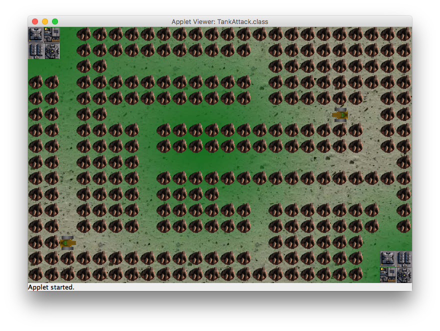

TankAttack
==========

<br>
One of the first games that I built, back on 2002 when the only tool I knew for it was a Java Applet.

Good memories and not that bad code.

The tank sprite, background and amazing ending ("game over"), all done by myself on Gimp ( I think... )

Thanks to my friend Giacomelli (http://github.com/giacomelli) for helping me think the game structure and even start the code.

--------

## How to run?
The game run as a Java Applet, nowadays is not that easy find a browser that run Java Applet, thus the best way to run in is use the AppletViewer.

Just open a terminal/console inside the src folder an type command below:

```shell
appletviewer TankAttack.html
```
## How to play?
This is a local multiplayer game, the objective is destroy the other player base.

### Player 1
* W = Move up
* D = Move right
* S = Move down
* A = Move left
* G = Fire 

### Player 2
* Up arrow = Move up
* Right arrow = Move right
* Down arrow = Move down
* Left arrow = Move left
* ENTER = Fire 